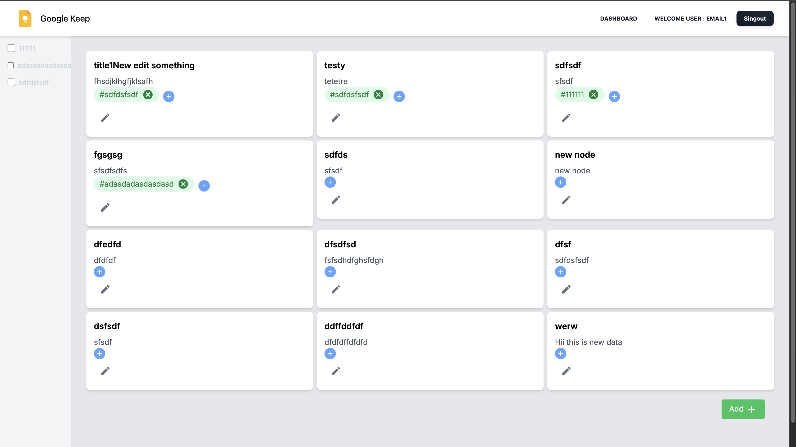

### Google keep clone using NextJS 14





#### Features
- Authentication : 🔐 **Login** & 🔏 **Register** for creating a new user
- 📝 **Notes** - Create, Update, Delete notes ( CRUD operations)
  * 🗒 **Simple Notes** - Update/delet text and title
  * add **Tags** for notes - ( add / remove )
- server side and client side rendering
- single end point `Graph API` implementation for efficient CRUD operations to avoid over-fetching compared to traditional
  REST architecture.
- nextJS api routes
- nextJS file stucture for modular page structure

#### Project Structure :
``` 
public
prisma
     |- schema.prisma
src
  |- app 
       |- api
            |-graphql 
                |- resolvers
                    |- notes
                    |- user
                    |- Tag
                |- typedefs
            |- auth
       |- components
       |- login
       |- register
       |- dashboard
  |- client
  |- hooks
  |- lib 
  |- utils

```

#### Frontned :
- React with Typescript
- Apollo client
- tailwindCSS

#### Backend :
- NextJS API routes
- Apollo server
- GraphQL
- prisma
- PostgreSQL

Install all dependencies
```bash
yarn install
```

run the application
```bash
yarn dev
```
Build docker image
```bash 
docker build -t google-keep .
```

run the docker container
```bash
bash run.sh
```
after running get the container id and kill the container 
- get the id `docker ps`
- kill the containern `docker stop <id>`
